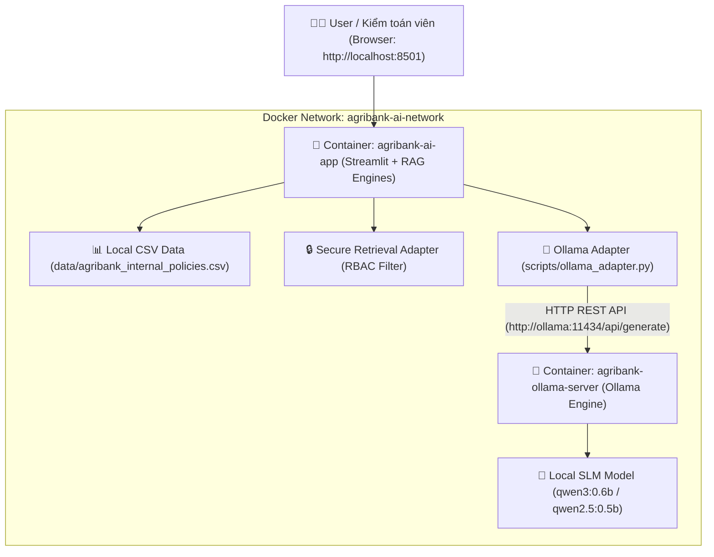

# BÀI THỰC HÀNH BUỔI 19
# Đóng gói Local AI System với Docker, Ollama (Model Qwen3:0.6B) & Streamlit Dashboard

## Mục tiêu

Buổi 19 tập trung vào việc chuyển đổi toàn bộ kiến trúc RAG Bảo mật & Kiểm toán Ngân hàng Agribank (từ Buổi 17 & 18) từ việc sử dụng Cloud Gemini API sang **Mô hình Local AI hoàn toàn Offline**, bảo mật dữ liệu tuyệt đối (On-Premise) sử dụng **Ollama** và **Model Qwen3:0.6B** (hoặc Qwen2.5-0.5B / Qwen2.5-1.5B), đồng thời đóng gói toàn bộ hệ thống bằng **Docker Containerization**.

```text
Hạ tầng Cloud Gemini API (Buổi 17/18) 
  ↓ (Chuyển đổi Buổi 19)
Local SLM Model (Qwen3:0.6B) + Ollama Container + Streamlit App Container (Docker Compose)
```

Sản phẩm cuối buổi:

```text
Hệ thống Local AI Containerized bao gồm:
+ Ollama Service Container (Chạy local model Qwen3:0.6b trên port 11434)
+ Agribank AI Web Application Container (Streamlit App + Core RAG Engines trên port 8501)
+ Ollama API Adapter (scripts/ollama_adapter.py) hỗ trợ Dual-Provider Switch (Ollama / Gemini)
+ Nâng cấp UC3 (Compliance Checker) & UC4 (Audit Checklist Gen) tương thích Local Model
+ Bộ Docker Configuration: Dockerfile, docker-compose.yml, requirements.txt
+ Kịch bản nghiệm thu Docker & Security Verification (outputs/b19_docker_acceptance_report.md)
```

---

# 1. Kiến trúc Hệ thống Docker & Local AI



---

# 2. Nguyên tắc bắt buộc

- **Hoàn toàn Offline & Bảo mật:** Dữ liệu quy định nội bộ và prompt tra cứu không được rời khỏi môi trường mạng cục bộ.
- **Không sửa dữ liệu nguồn:** Giữ nguyên các tệp `data/agribank_internal_policies.csv` và `data/chunks_combined_secure.csv`.
- **Chuyển đổi linh hoạt (Dual Provider):** Hệ thống phải hỗ trợ biến môi trường `LLM_PROVIDER` (`ollama` hoặc `gemini`) trong `.env` để dễ dàng switch giữa Cloud API và Local Ollama.
- **Trích dẫn chính xác & Human Review:** 100% kết quả mâu thuẫn hay checklist từ Ollama phải gắn `citation` chuẩn xác và cờ `NEEDS_HUMAN_REVIEW`.
- **Đóng gói Chuẩn Docker:** Chạy toàn bộ hệ thống chỉ với một lệnh duy nhất `docker compose up -d`.

---

# 3. Cấu trúc project Buổi 19

```text
buoi_17/ (hoặc buoi_19/)
├── .env                              # Khai báo LLM_PROVIDER=ollama, OLLAMA_BASE_URL, OLLAMA_MODEL
├── Dockerfile                        # Dockerfile đóng gói ứng dụng Streamlit & RAG Engines
├── docker-compose.yml                # Docker Compose orchestrate Ollama & App containers
├── requirements.txt                  # Python dependencies cho Container
├── README.md
├── data/
│   ├── agribank_internal_policies.csv
│   └── chunks_combined_secure.csv
├── scripts/
│   ├── ollama_adapter.py             # Ollama REST API Adapter Client
│   ├── compliance_checker.py        # Core Engine UC3 (hỗ trợ Ollama / Gemini)
│   ├── audit_checklist_gen.py       # Core Engine UC4 (hỗ trợ Ollama / Gemini)
│   ├── secure_retrieval_adapter.py
│   ├── audit_logger.py
│   └── verify_b19_docker.py          # Kịch bản nghiệm thu Docker & Local Model Buổi 19
├── outputs/
│   ├── b19_docker_acceptance_report.md
│   ├── compliance_conflicts.csv
│   ├── audit_checklist_results.csv
│   └── audit_log.jsonl
└── app.py                           # Web UI Streamlit tương thích Local Model & Docker
```

---

# 4. Tệp cấu hình `.env` cho Buổi 19

```env
# Buổi 19 Local Ollama & Docker Setup
LLM_PROVIDER=ollama
OLLAMA_BASE_URL=http://localhost:11434
OLLAMA_MODEL=qwen3:0.6b

# Cloud Gemini Fallback (Optional)
GEMINI_API_KEY=YOUR_GEMINI_API_KEY_FREE
LLM_API_KEY=YOUR_GEMINI_API_KEY_FREE
LLM_MODEL=gemini-3.6-flash

APP_ENV=training
```

---

# 5. Các Prompt Thực Hành Buổi 19

---

# PROMPT SETUP — Kiểm tra Môi trường Docker & Ollama

```text
Kiểm tra giúp tôi môi trường Docker và các tệp dữ liệu Buổi 19.

Kiểm tra:
- Lệnh `docker --version` và `docker compose version` trên hệ thống;
- Đảm bảo các file dữ liệu data/agribank_internal_policies.csv và data/chunks_combined_secure.csv sẵn sàng;
- Đảm bảo thư mục scripts/ và outputs/ sẵn sàng;
- File .env đã có tham số LLM_PROVIDER=ollama và OLLAMA_MODEL=qwen3:0.6b chưa.

Báo kết quả:
DOCKER READY: YES / NO
DATA READY: YES / NO
ENV CONFIG READY: YES / NO
```

---

# PROMPT 1 — Xây dựng Ollama API Adapter Client (`scripts/ollama_adapter.py`)

```text
Tạo file:
scripts/ollama_adapter.py

Yêu cầu:
1. Xây dựng lớp `OllamaClient` giao tiếp trực tiếp với Ollama REST API (`/api/generate` và `/api/tags`).
2. Tự động đọc đường dẫn OLLAMA_BASE_URL (mặc định http://localhost:11434 hoặc http://ollama:11434) và OLLAMA_MODEL (mặc định qwen3:0.6b).
3. Cung cấp hàm `check_health()` để kiểm tra Ollama Server online/offline và danh sách models đã tải.
4. Cung cấp hàm `generate(prompt, format_json=False, temperature=0.2)` gửi prompt và nhận văn bản / JSON từ mô hình Qwen3:0.6b.
5. Hỗ trợ fallback an toàn dạng rule-engine khi Ollama Server chưa bật.

Chạy kiểm tra thử nghiệm module:
python scripts/ollama_adapter.py

Xuất báo cáo nhỏ:
OLLAMA ADAPTER: PASS / FAIL
OLLAMA SERVER ONLINE: YES / NO
```

---

# PROMPT 2 — Cập nhật Core Engines (UC3 & UC4) Tương thích Local Model

```text
Cập nhật các file backend trong scripts/:
1. scripts/compliance_checker.py (UC3)
2. scripts/audit_checklist_gen.py (UC4)
3. scripts/internal_lookup.py (UC1)
4. scripts/compliance_gap.py (UC2)

Yêu cầu:
1. Đọc biến môi trường LLM_PROVIDER từ .env.
2. Nếu LLM_PROVIDER == "ollama", khởi tạo OllamaClient và gửi prompt sang Local Model Qwen3:0.6b.
3. Nếu LLM_PROVIDER == "gemini", duy trì kết nối với Gemini Client.
4. Đảm bảo cấu trúc prompt ép kiểu định dạng JSON chuẩn xác cho cả 2 Use Cases.
5. 100% kết quả sinh ra giữ nguyên cờ review_status = "NEEDS_HUMAN_REVIEW" và đính kèm đầy đủ Citation văn bản gốc.

Chạy thử nghiệm kiểm tra 2 engine ở chế độ Ollama:
python scripts/compliance_checker.py
python scripts/audit_checklist_gen.py
```

---

# PROMPT 3 — Xây dựng Docker Containerization Setup

```text
Tạo các tệp đóng gói Docker cho dự án:

1. requirements.txt:
   Liệt kê đầy đủ thư viện: streamlit, pandas, requests, python-dotenv, google-genai.

2. Dockerfile:
   - Base image: python:3.10-slim.
   - Set UTF-8 encoding và PYTHONUNBUFFERED=1.
   - Copy requirements.txt và pip install.
   - Copy toàn bộ mã nguồn.
   - Expose port 8501.
   - CMD chạy python -m streamlit run app.py --server.address=0.0.0.0 --server.port=8501.

3. docker-compose.yml:
   - Service 1: `ollama` (image: ollama/ollama:latest, ports 11434:11434, volume ollama_data).
   - Service 2: `app` (build từ Dockerfile hiện tại, ports 8501:8501, environment LLM_PROVIDER=ollama, OLLAMA_BASE_URL=http://ollama:11434, depends_on: ollama).

Kiểm tra cú pháp Docker configuration:
docker compose config
```

---

# PROMPT 4 — Khởi chạy Docker Containers & Tải Local Model Qwen3:0.6B

```text
Thực thi quy trình đóng gói và tải model cục bộ:

1. Chạy Docker Compose để dựng các container:
   docker compose up -d

2. Tải model qwen3:0.6b vào Ollama container:
   docker exec -it agribank-ollama-server ollama run qwen3:0.6b "Xin chào"

3. Kiểm tra container status:
   docker compose ps

4. Kiểm tra ứng dụng Web hoạt động tại http://localhost:8501.
```

---

# PROMPT 5 — Security & Local Guardrail Testing cho Buổi 19

```text
Đóng vai Security Tester kiểm thử hệ thống Local AI Containerized Buổi 19.

Thực hiện kiểm tra 6 hạng mục an toàn:
1. Local Offline Privacy Check: Đảm bảo 100% prompt không gửi ra Internet khi dùng LLM_PROVIDER=ollama.
2. RBAC Enforcement: Kiểm tra Role 'Staff' bị chặn 100% dữ liệu bảo mật rủi ro trên container.
3. Citation Integrity: Mọi kết quả từ model Qwen3:0.6b đều có trích dẫn Điều/Khoản hợp lệ.
4. Human Review Guardrail: 100% kết quả có review_status = "NEEDS_HUMAN_REVIEW".
5. Audit Log Privacy: Không lộ API key hay secret trong audit log.
6. Local Model Resilience: Thử nghiệm ngắt mạng Internet xem hệ thống AI vẫn phản hồi bình thường không.
```

---

# PROMPT 6 — Audit Toàn bộ Project & Final Validation Buổi 19

```text
Audit toàn bộ hệ thống Buổi 19 và tạo báo cáo nghiệm thu đóng gói Docker cuối cùng.

Tạo file:
scripts/verify_b19_docker.py

Xuất báo cáo tại:
outputs/b19_docker_acceptance_report.md

Kiểm tra các tiêu chí:
1. Ollama Server Connectivity: Kết nối thành công tới HTTP API endpoint /api/tags.
2. Local Model Availability: Model Qwen3:0.6b (hoặc Qwen2.5) sẵn sàng trong Ollama registry.
3. Dual Provider Switch: Chuyển đổi linh hoạt giữa Ollama và Gemini.
4. Docker Compose Packaging: Dockerfile và docker-compose.yml hoàn chỉnh, hợp lệ.
5. Local UC3 & UC4 Engines: Sinh được mâu thuẫn và checklist kiểm toán bằng mô hình local.
6. Human Review & Audit Log: Đảm bảo đầy đủ cờ bảo vệ và nhật ký truy vết.

Đánh giá tổng thể ở cuối file:
OLLAMA SERVER STATUS: PASS / FAIL
LOCAL MODEL QWEN3: PASS / FAIL
DOCKER CONTAINERIZATION: PASS / FAIL
LOCAL COMPLIANCE ENGINES: PASS / FAIL

LOCAL AI SYSTEM READY: YES / NO
```

---

# 6. Trình tự Demo cuối buổi 19

1. **Trình bày Kiến trúc Local AI & Docker Compose:**
   - Mở Terminal chạy `docker compose ps` hiển thị 2 containers `agribank-ollama-server` và `agribank-ai-app` đang chạy ONLINE.
2. **Demo Chế độ Local Offline với Qwen3:0.6B:**
   - Mở giao diện Streamlit tại `http://localhost:8501`.
   - Chuyển chọn vai trò `Kiểm toán viên` -> Thực hiện phát hiện xung đột UC3 và sinh checklist kiểm toán UC4 hoàn toàn bằng mô hình Local SLM Qwen3:0.6B.
3. **Demo Ngắt Kết Nối Internet (Air-gapped Demo):**
   - Rút dây mạng/Tắt Wifi -> Hệ thống vẫn tiếp tục chạy mượt mà, trả lời tra cứu và sinh checklist kiểm toán tức thì.
4. **Trình bày Báo cáo Nghiệm thu:**
   - Mở tệp `outputs/b19_docker_acceptance_report.md` minh chứng hệ thống đạt chuẩn `LOCAL AI SYSTEM READY: YES`.